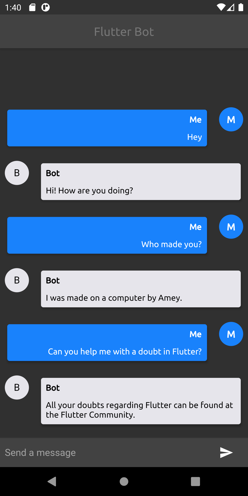
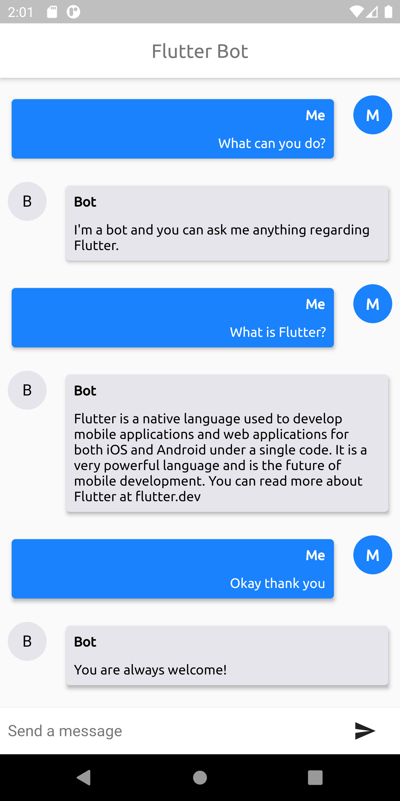

# chatbot

Chatbot using Flutter and DialogFlow

## Getting Started

This project is a starting point for a Flutter application.

A few resources to get you started if this is your first Flutter project:

- [Lab: Write your first Flutter app](https://flutter.dev/docs/get-started/codelab)
- [Cookbook: Useful Flutter samples](https://flutter.dev/docs/cookbook)

For help getting started with Flutter, view our
[online documentation](https://flutter.dev/docs), which offers tutorials,
samples, guidance on mobile development, and a full API reference.

## Dialog Flow

#### Dialog Flow is a natural language understanding platform by Google used to design and create conversational UI for mobile and web apps.

- Visit [Dialog Flow](http://dialogflow.cloud.google.com) to get started with Dialog Flow.
- Create a new project, and add intents as per you wish.
- Checkout [DialogFlow Documentation](https://cloud.google.com/dialogflow/es/docs/quick) or [video demo](https://www.youtube.com/watch?v=Ov3CDTxZRQc) for any queries.

## Google Cloud Platform API

- Choose your project from GCP and then generate credentials from the APIs & Services dashboard.
- Create a service account or if you have one, then open up the link from the Service Accounts section at the bottom.
- Then add a key and choose the JSON file, which automatically downloads to your system.
- Rename it to `dialog_flow_auth.json` and add it in the assets file.

## Troubleshooting

For iOS, cd into `ios` folder and run `rm -rf Podfile.lock`, if any error during build persists.

## Screenshots

  
